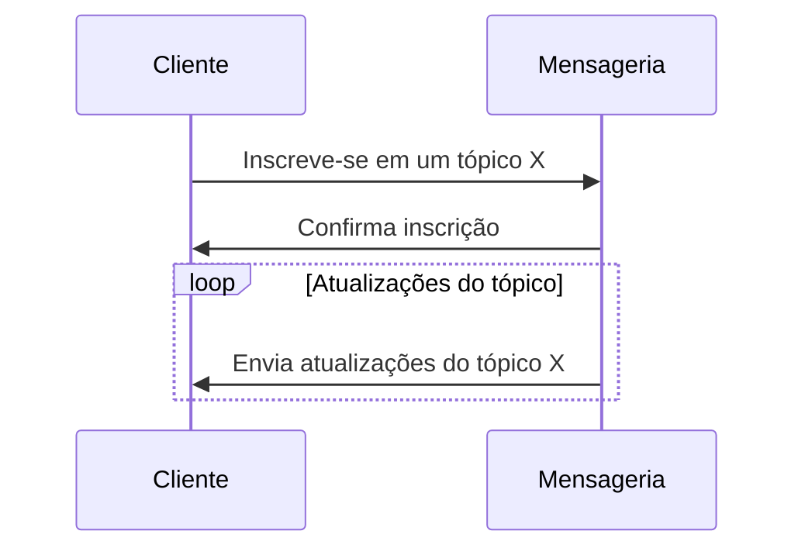
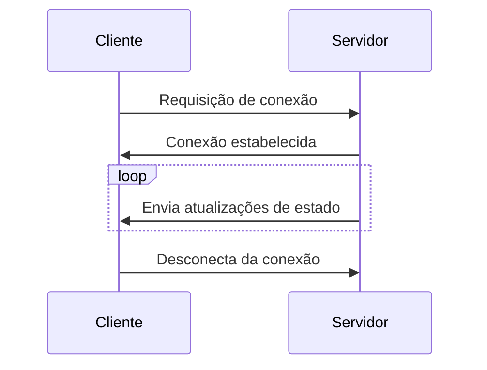
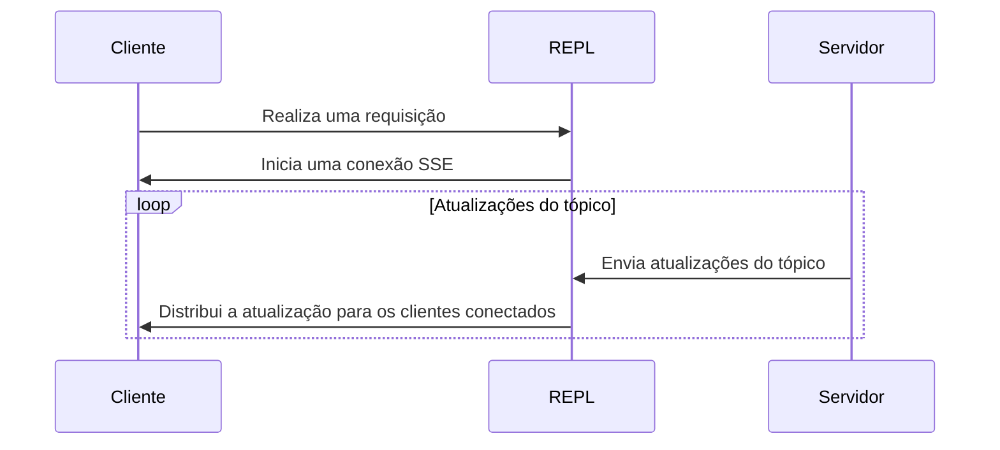

# Sistema de mensageria distribuído para web em tempo real

## Índice

1. [Resumo](#1-resumo)
2. [Introdução](#2-introdução)
3. [Desenvolvimento](#3-desenvolvimento)
   1. [Aplicações web e microsserviços](#31-aplicações-web-e-microsserviços)
   2. [Escalabilidade horizontal e aplicações em tempo real](#32-escalabilidade-horizontal-e-aplicações-em-tempo-real)
   3. [Solução proposta](#33-solução-proposta)
   4. [Protocolo de consenso](#34-protocolo-de-consenso)
   5. [Implementação](#35-implementação)
   6. [Comparação entre sistemas de mensageria](#36-comparação-entre-sistemas-de-mensageria)

## 1. Resumo

Este trabalho tem como objetivo apresentar o desenvolvimento de uma aplicação de mensageria distribuída como uma abordagem para problemas de escalabilidade para aplicações web que se utilizem de recursos em tempo real, em especial para casos onde existe a comunicação entre cliente-servidor.
A aplicação foi desenvolvida utilizando a linguagem de programação Go e disponibiliza um cliente em Javascript/Typescript para ser utilizado em aplicações web.

## 2. Introdução

Aplicações web com interação em tempo real são cada vez mais comuns, seja para fins de comunicação entre usuários, seja para fins de monitoramento de dados em tempo real. Uma grande quantidade de aplicações são desenvolvidas com interatividade e experiência do usuário em mente, e a comunicação em tempo real é um dos recursos que mais contribuem para isso. Redes sociais são um exemplo de aplicações que utilizam recursos em tempo real, elas comumente implementam recursos em tempo real para notificações de novas mensagens, curtidas ou comentários. Essas interações enriquecem a experiência do usuário, não necessitando de recarregamento ou ações manuais para para que as novas informações sejam exibidas.
Tendo isso em mente, o objetivo desse trabalho é apresentar uma aplicação alternativa para elaboração de aplicações web com recursos em tempo real, simplificando a implementação de tais recursos no lado do cliente e do servidor. Além da aplicação, serão apresentados os resultados de testes de desempenho e escalabilidade, comparando a aplicação desenvolvida com modelos de arquitetura padrões para esse tipo de problema.

## 3. Desenvolvimento

Este trabalho origina-se das necessidades das aplicações web atuais, onde cada vez são adicionadas mais funcionalidades no lado do cliente para que a experiência do usuário seja a melhor possível. Com isso, a complexidade das aplicações aumenta, e a necessidade de uma comunicação em tempo real entre cliente e servidor se torna cada vez mais comum. A comunicação em tempo real entre cliente e servidor é um problema que pode ser resolvido de diversas formas, e cada uma delas possui suas vantagens e desvantagens. A aplicação desenvolvida neste trabalho tem como objetivo simplificar a implementação de recursos em tempo real no lado do cliente e do servidor, além de ser uma alternativa para problemas de escalabilidade.

## 3.1 Aplicações web e microsserviços

Originalmente, aplicações web tradicionais eram monolíticas, isto é, necessitavam de uma única máquina para serem executadas. Com o crescimento da web e a disponibilização de vários serviços com milhares de usuários através dela, a quantidade de processamento necessária para atender a demanda de usuários cresceu exponencialmente. Com isso, a necessidade de escalabilidade também cresceu, e a arquitetura de aplicações web evoluiu para um modelo distribuído, onde a aplicação é executada em várias máquinas, e cada uma delas é responsável por uma parte da aplicação. Esse modelo de arquitetura é conhecido como arquitetura de microsserviços.

Arquiteturas de microsserviços consistem na divisão de uma aplicação em diversos serviços menores, cada um com sua própria responsabilidade. Isso permite que a aplicação seja dividida em pequenos módulos, cada um com seu domínio especializado e seus recursos computacionais. Essa abordagem possibilita que cada serviço seja escalado individualmente, de acordo com a demanda de cada um. Além disso, a divisão da aplicação em serviços menores permite que cada serviço seja desenvolvido utilizando a linguagem de programação mais adequada para o problema que ele resolve, e que cada serviço seja executado em uma máquina diferente. Isso permite que a aplicação seja escalada horizontalmente, isto é, que ela seja executada em várias máquinas diferentes, cada uma responsável por um serviço diferente. Essa abordagem é conhecida como escalabilidade horizontal.

## 3.2 Escalabilidade horizontal e aplicações em tempo real

A escalabilidade horizontal vem com seus próprios desafios, em especial para aplicações que necessitam de estado. Aplicações web tradicionais, que utilizam o modelo de arquitetura monolítica, possibilitam o armazenamento de estado, uma vez que executam em um único servidor, entretanto a escalabilidade desse tipo de aplicação é limitada e custosa, pois necessita de acréscimo de hardware para aumentar seu poder computacional.

Para aplicações distribuídas, a escalabilidade horizontal facilita o aumento de poder computacional, sendo necessário apenas adicionar mais servidores em um _cluster_. Porém, esse tipo de escalabilidade apresenta um desafio para servidores que necessitam manter conexão com o cliente, como é o caso das aplicações web em tempo real. Nesses casos, é comum ver arquiteturas como na da imagem abaixo.

Nesse tipo de arquitetura, utiliza-se um serviço de mensageria para notificar servidores de atualização de estado, para que ele possa distribuir isso para outras máquinas conectadas em um cluster. Essa é uma das estratégias que serviços que se utilizam de atualizações em tempo real implementam.

Essa é uma abordagem válida, porém adiciona complexidade na implementação do sistema, como gerenciamento da infraestrutura do serviço de mensageria e a implementação da lógica de distribuição de mensagens no servidor de comunicação, além do gerenciamento de clientes conectados nos servidores.

## 3.3 Solução proposta

O intuito da aplicação desenvolvida nesse trabalho é simplificar a complexidade da arquitetura necessária para desenvolver aplicações em tempo real para a web. Adicionando um único serviço de mensageria, responsável por receber as atualizações da aplicação e distribuí-la entre os clientes conectados.

A distribuição das mensagens é feita através de tópicos, onde cada tópico é responsável por um tipo de mensagem. Os clientes podem se inscrever em um ou mais tópicos, e o serviço de mensageria distribuí as mensagens para os clientes inscritos em cada tópico. Essa abordagem simplifica a implementação de serviços em tempo real, uma vez que para notificar clientes conectados de uma atualização, é necessário somente a publicação de uma mensagem para um tópico.

Nesse modelo, para que o cliente receba atualizações de um tópico, ele precisa se inscrever no tópico desejado. Após a inscrição, o cliente passa a receber atualizações do tópico, e pode se inscrever em outros tópicos, podendo receber atualizações de vários tópicos ao mesmo tempo.

Para a aplicação, os clientes se conectam através do padrão _Server-Sent-Events_ (Eventos enviados pelo servidor), um padrão de comunicação unidirecional baseado em mensagens enviadas pelo servidor através do protocolo HTTP.

Essa tecnologia possibilita que o servidor envie mensagens para o cliente através de uma conexão HTTP, sem que o cliente precise fazer requisições ativamente para o servidor. O cliente pode se conectar ao servidor através de um endpoint específico, e o servidor pode enviar mensagens para o cliente através de um outro endpoint específico. O cliente pode se desconectar do servidor a qualquer momento, e o servidor pode enviar mensagens para o cliente enquanto a conexão estiver estabelecida.

A principal vantagem do SSE em relação a alternativas como WebSocket é a simplicidade da implementação e velocidade de desenvolvimento. O SSE é uma tecnologia nativa do protocolo HTTP, e não necessita de bibliotecas externas para ser implementado. Além disso, o SSE é um protocolo unidirecional, o que simplifica a implementação do servidor, uma vez que ele não precisa gerenciar requisições do cliente.

## 3.4 Protocolo de consenso

O sistema funciona em modo de nó único e em cluster. Em modo de nó único, o sistema executa em uma única máquina, e não é possível adicionar mais nós. Em modo de cluster, o sistema executa em várias máquinas, e é possível adicionar mais nós ao cluster. O sistema utiliza o protocolo Raft para consenso entre os nós do cluster, para garantir consistência entre os nós e a entrega da mensagem para os tópicos entre cada máquina do cluster. Inicialmente os nós contam com um "bootstrap" para que o cluster seja inicializado, esse nó é responsável por iniciar o cluster e adicionar novos nós ao cluster.

O processo de replicação no Raft inicia com a eleição de um líder, que é responsável por coordenar e distribuir as operações para os demais servidores seguidores. O líder recebe comandos dos clientes, adiciona esses comandos ao seu log e replica esses logs para os seguidores. Os seguidores, por sua vez, aplicam esses comandos aos seus estados, mantendo assim a consistência entre os diferentes servidores no cluster.

O Raft lida eficientemente com situações de falha, como a queda de um líder, ao realizar eleições de forma determinística, garantindo a continuidade operacional do sistema. Além disso, a simplicidade do Raft facilita a compreensão do protocolo, permitindo uma implementação mais precisa e robusta.

A escolha do Raft em relação a outros protocolos de consenso se dá principalmente pela facilidade da sua compreensão, em especial quando comparado com outros protocolos como o Paxos. As principais considerações pela sua escolha foram:

- Simplicidade e Entendimento: O Raft é reconhecido por sua clareza e simplicidade conceitual, facilitando o entendimento e implementação. Em um projeto de tamanha importância como um sistema de mensageria distribuída, a simplicidade do Raft torna-se uma vantagem significativa.

- Processo de Eleição Determinística: O Raft utiliza um processo de eleição determinística, evitando ambiguidades associadas à eleição em ambientes complexos. Esse determinismo é crucial para manter a coerência do sistema em situações de falha.

- Manutenção e Evolução do Código: A clareza do Raft simplifica a manutenção do código ao longo do tempo. Compreender e modificar o código é mais acessível, resultando em um desenvolvimento mais eficiente e menos propenso a erros.

- Facilidade de Implementação no Contexto do Apache Kafka: Dado que o Raft foi projetado para ser acessível e compreensível, sua integração com o Apache Kafka, um sistema de mensageria distribuída, é mais direta. A arquitetura do Raft alinha-se de maneira eficiente com os requisitos de replicação do Apache Kafka.

## 3.5 Implementação

A aplicação foi desenvolvida em Go originalmente por se tratar de uma linguagem compilada e de simples compreensão. A linguagem conta com construções primitivas de concorrência, que é um dos pontos essenciais para a implementação de um sistema de mensageria distribuída. Além disso, a linguagem conta com uma biblioteca padrão extensiva que facilita o desenvolvimento de servidores web.

O servidor conta com uma API REST para gerenciamento de tópicos e um endpoint SSE para comunicação com os clientes. A API REST é responsável por gerenciar os tópicos, permitindo a criação, listagem e remoção de tópicos, além de publicação de mensagens. O endpoint SSE é responsável por distribuir as mensagens para os clientes conectados.

A premissa base do sistema é a distribuição por tópicos, o que facilita o roteamento e a distribuição de mensagens entre os clientes. Cada tópico atua como uma fila de mensagens, de contexto específico e com um conjunto de clientes inscritos. Quando uma mensagem é publicada em um tópico, ela é distribuída para todos os clientes inscritos no tópico.

Esse modelo de tópicos resulta em uma distribuição de mensagens mais eficiente, uma vez que as mensagens são distribuídas apenas para os clientes inscritos no tópico, e não para todos os clientes conectados ao servidor. Além disso, esse modelo permite que os clientes se inscrevam em tópicos específicos, recebendo apenas as mensagens que são relevantes para eles.

Além disso, o sistema conta com um processo de replicação de mensagens entre os nós do cluster, garantindo a consistência entre os nós e a entrega das mensagens para os tópicos. O processo de replicação é feito através do protocolo de consenso Raft, onde no modo cluster todas as atualizações de estado do sistema são processadas através de uma máquina de estado finita determinística, da qual processa cada operação sequencialmente e garante a consistência entre os nós do cluster.

## 3.6 Comparação entre sistemas de mensageria

Abaixo temos uma tabela comparativa entre o sistema desenvolvido neste trabalho (REPL), o Kafka e o Redis Pub/Sub.

| Métrica                       | Kafka             | Redis Pub/Sub     | REPL (Aplicação)  |
| ----------------------------- | ----------------- | ----------------- | ----------------- |
| Cluster                       | Sim               | Sim               | Sim               |
| Modelo de mensageria          | Publish/Subscribe | Publish/Subscribe | Publish/Subscribe |
| Protocolo de consenso         | Zookeeper         | N/A               | Raft              |
| Linguagem de programação      | Java/Scala        | C                 | Go                |
| Protocolo de comunicação      | TCP               | TCP               | HTTP              |
| Mensagens                     | Bytes             | Bytes             | JSON              |
| Persistência                  | Sim               | Sim               | Não               |
| Tópicos                       | Sim               | Sim               | Sim               |
| Garante a entrega da mensagem | Sim               | Não               | Não               |
| Garante a ordem das mensagens | Sim               | Não               | Não               |

## Desenvolvimento (Tarefas)

- [x] Finalização do modelo de arquitetura do sistema;
- [x] Explicação do protocolo SSE e descrição do motivo pelo qual a gente escolheu ele;
- [x] Explicação a respeito do funcionamento do sistema (divisão de tópicos para clientes conectados);
- [x] Tabela comparativa dos principais sistemas de mensageria (Kafka, Redis Pub/Sub, e a nossa aplicação);
- [x] Descrição dos requisitos não funcionais: limitações do sistema;
  - Limite do tamanho de mensagens
  - O sistema vai salvar as mensagens?
  - O sistema vai ter um limite de conexões?
- [x] Descrição da implementação do sistema
  - Como o sistema foi implementado
  - Como funciona a distribuição de mensagens
  - Como funciona a divisão de tópicos

## Tarefas (escrita)

- [ ] Resultados, análise e discussão:
  - [ ] Finalização da implementação do sistema;
  - [ ] Aplicações demo para testes de desempenho;
  - [ ] Dados dos testes de desempenho;
  - [ ] Análise dos dados dos testes de desempenho;
  - [ ] Discussão dos resultados (quantitativo): performance do sistema e escalabilidade;
  - [ ] Discussão dos resultados (qualitativo): facilidade de implementação e manutenção;
- [ ] Conclusão
